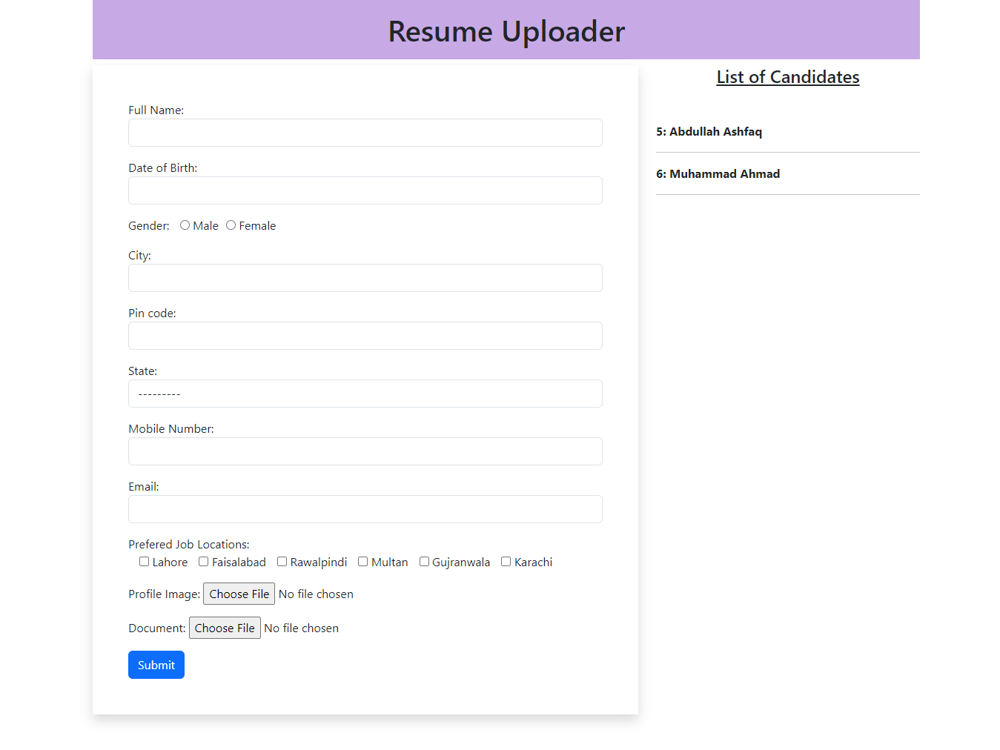

# Django Resume Uploader App

This Django project focuses on managing form data, including images and files.

## Overview



## Project Setup Instructions

Follow these steps to run the project on your local machine.

#### Python Environment

Open your terminal and navigate to the project directory. Then, run the following command to create a virtual environment named venv.
```
python -m venv venv
```

Once the virtual environment is created, activate it by running `venv\Scripts\activate` on your terminal if you're in Windows.

#### Install Dependencies

Install the required dependencies listed in the requirements.txt file by running:
```
pip install -r requirements.txt
```

#### Run the Django Server

Before running the server, apply migrations to set up the database schema.
```
python manage.py makemigrations
python manage.py migrate
```

Once the migrations are applied, start the Django server:
```
python manage.py runserver
```
Access the development server through your web browser at **http://127.0.0.1:8000/** or **http://localhost:8000/**.

That's it! You've successfully set up and launched the project locally.

**Note:** To deactivate the virtual environment, simply run `deactivate` on your terminal.

## Contributions

Contributions to this project are welcome! If you have ideas for improvement, bug fixes, or additional features, open an issue or fork this repository and submit a pull request.

## License

This project is under the [MIT License](./LICENSE). You are free to use, modify, and distribute the code under the license terms.

Project created by Abdullah Ashfaq - [GitHub](https://github.com/abdullahashfaq-ds)
